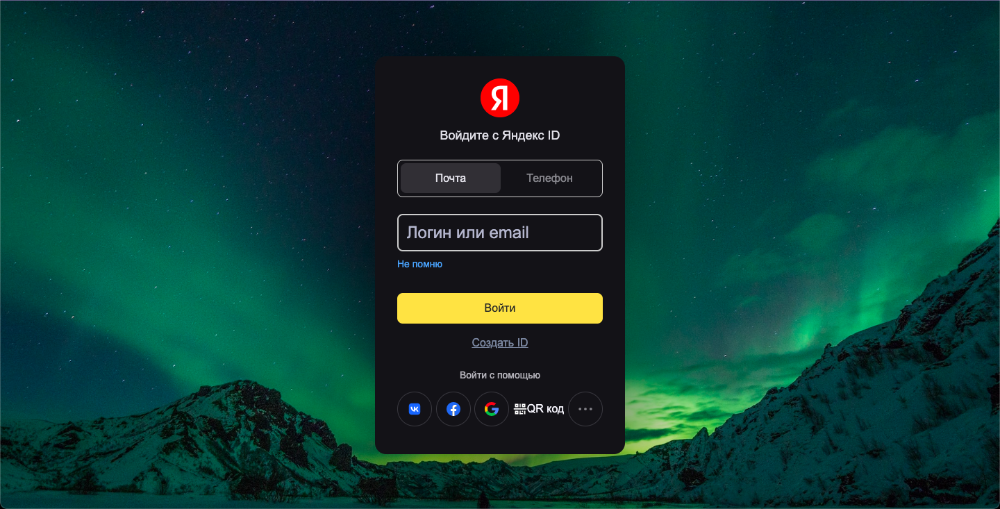
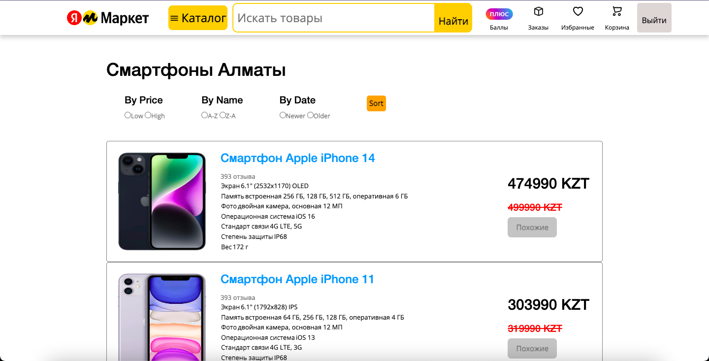
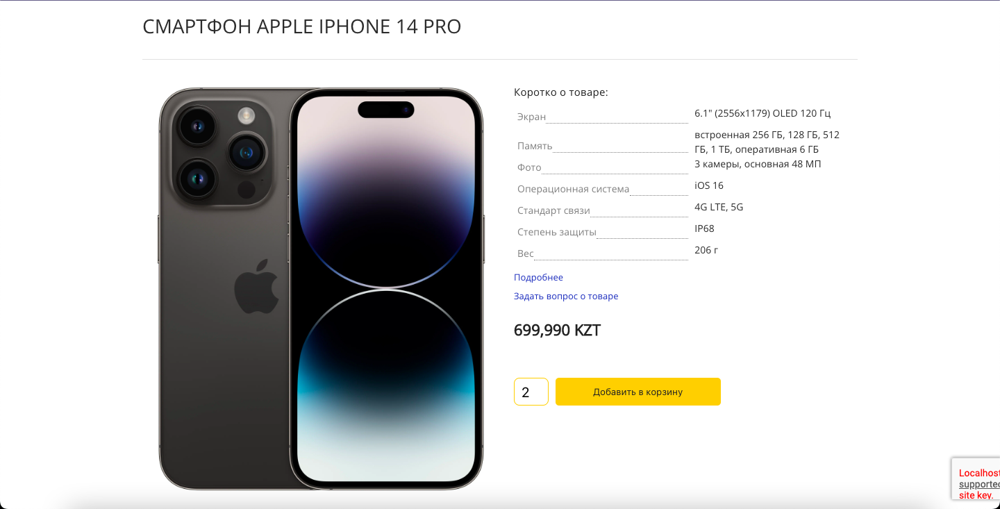
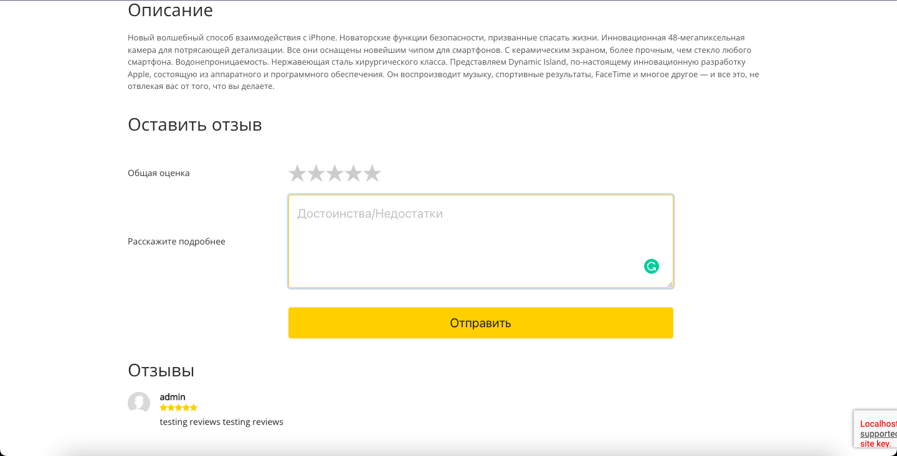
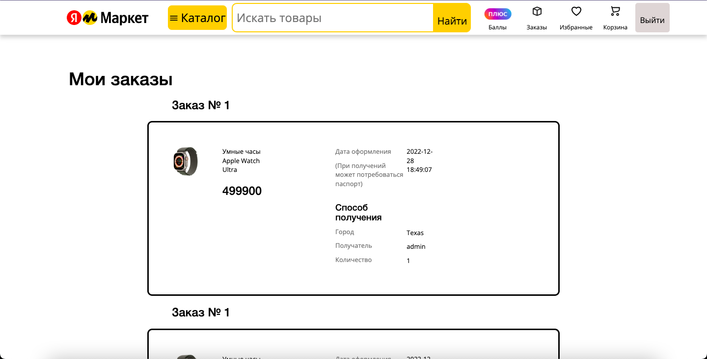
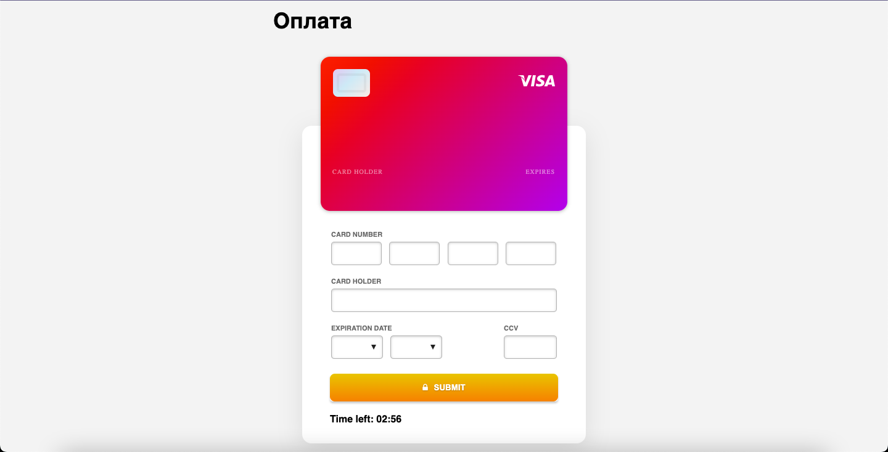

# Yandex Market
An online store is a virtual store on the Internet where customers can browse the catalog and select products of interest. The selected items may be collected in a shopping cart. Then the items in the shopping cart will be presented as an order. At that time, more information will be needed to complete the transaction. Usually, the customer will be asked to fill or select a billing address, a shipping address, a shipping option, and payment information such as credit card number.  
  Based on the [Yandex Market](https://market.yandex.kz/).
  
## Business Rules
- Registration & login.
- Yandex Plus subscription process with card validation. For users with a Yandex Plus subscription, give a discount on some products.
- Implement sorting of products by price and novelty.
- Add product search by name.
- The ability to add and view customer reviews for certain products with rates.
- View the shopping cart and the ability to delete unwanted items. Payment for items in the shopping cart using a credit card with validation.
- View the order history.

## Main Pages

