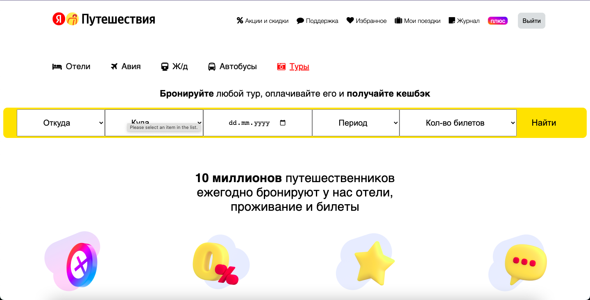
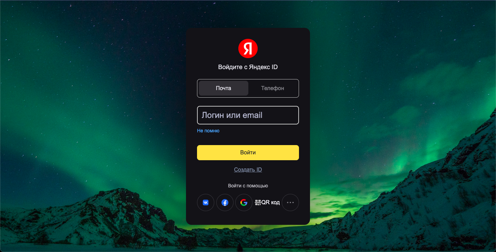

# Yandex Travel
The Tour Booking System is intended for the travel service. It will assist the clients with booking the air ticket through this utilization of the travel service. The user can view the tour information for selected destination in selected date and time.  
  Based on the [Yandex Travel](https://travel.yandex.ru/).
  
## Business Rules
- Registration & login.
- Add 3 tours in different directions. The dates and the number of nights are also different.
- When choosing a tour, a page with hotels opens. Add 3 hotels for each tour with different cost and star rating of the hotel.
- After choosing a hotel, immediately redirect to the page of filling in personal data and payment. When validating the card, let the timer run (3 minutes).
- Implement a bonus system: when subscribing to Yandex Plus, 5% of the cost is credited to the account. You can view the Yandex Plus account balance in your personal account.
- Purchased tours should be displayed in My Trips.

## Main Pages

